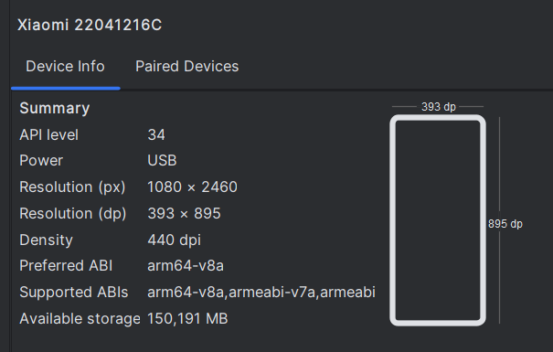
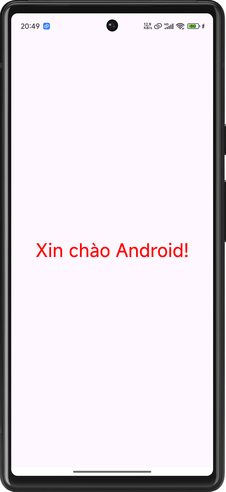
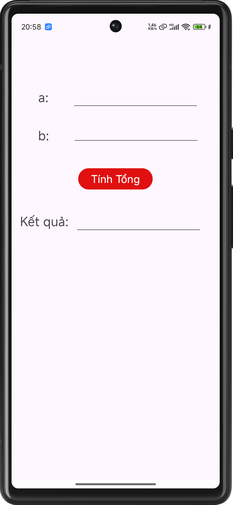
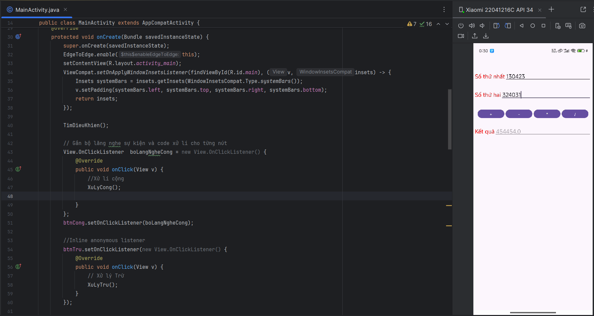

# Môn học: **Lập trình thiết bị di động**

## Giới thiệu
Repository này dùng để lưu bài tập và bài thực hành trong quá trình học môn Lập trình Thiết bị di động.

## Thông tin về học phần

### Tên học phần:
* Tiếng Việt: LẬP TRÌNH THIẾT BỊ DI ĐỘNG
* Tiếng Anh: MOBILE PROGRAMMING

Học phần cung cấp các kiến thức để người học có thể xây dựng được ứng dụng chạy trên thiết bị di động sử dụng hệ điều hành Android sử dụng cú pháp ngôn ngữ Java

## Công nghệ sử dụng
* IDE: Android Studio
* API: 24 ("Nougat"; Android 7.0)
* Ngôn ngữ: Java

## Thông tin sinh viên

* Tên sinh viên: **Nguyễn Thành Đạt**
* MSSV: **65130423**
* Trường : **[Đại học Nha Trang](https://ntu.edu.vn/)**

## Ghi chú
Phần mềm được thiết kế trên điện thoại Redmi note 11T pro 5G kích thước 6.6 inch, độ phân giải Full HD+ (1080 x 2460 pixel), có thể sẽ không hiển thị như mong muốn trên thiết bị của bạn

---
## Bài tập đã thực hiện

 ### Bài 1: Hello Android
 ***Hello Andoid**, ứng dụng đầu tiên*
 
 #### [Chi tiết bài tập](./HelloAndroid)

 ### Bài 2: Phần mềm Tính tổng
 *App thực hiện hiện tính tổng từ 2 số nhập vào từ bàn phím*
 
 #### [Chi tiết bài tập](./BaiTH2/BaiTH2_2_HoanThienUngDungTinhTong2So)

 ### Bài 3: Linear Layout
 *Bài thực hành, tương tác với các điều khiển cơ bản, sử dụng thuộc tính **onClick** của Button để code mã đáp ứng sự kiện*

  #### [Chi tiết bài tập](./BaiTH3_LinearLayOut01/)

 ### Bài 4: LinearLayOut_Tong2So
 *Bài thực hành, Sủ dụng **Linear Layout** cho ứng dụng tính*

 #### [Chi tiết bài tập](./BaiTH4_LinearLayOut_Tong2So)

 ### Bài 5: BaiTH5_XuLySuKien1
 *Ứng dụng tính toán tương tự như [BaiTH4_LinearLayOut_Tong2So](./BaiTH4_LinearLayOut_Tong2So/) nhưng sử dụng Bộ lắng nghe sự kiện **Ẩn danh***
 
#### [Chi tiết bài tập](./BaiTH5_XuLySuKien1/)

